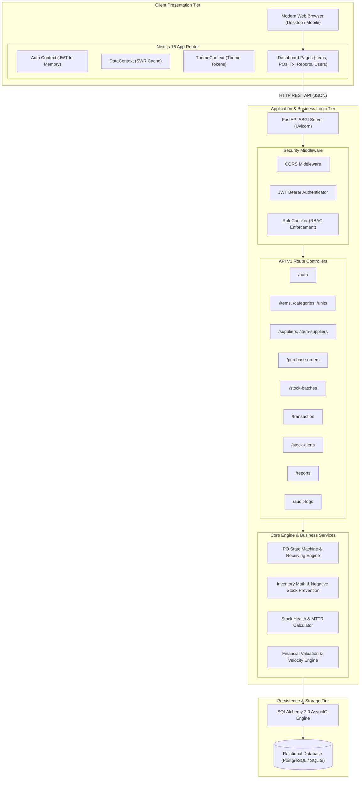
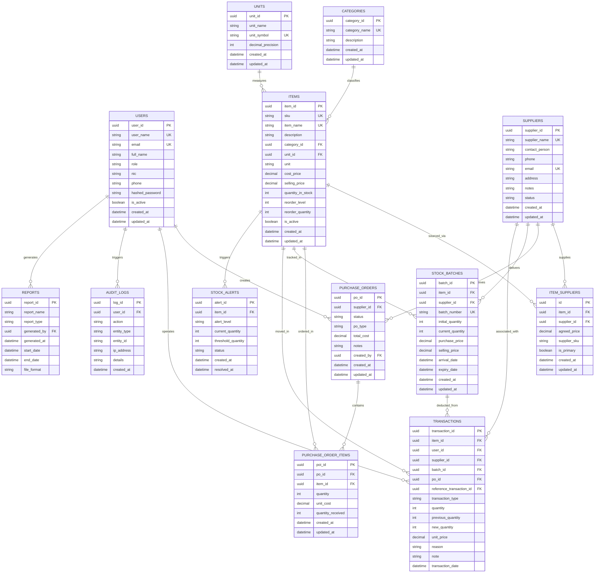
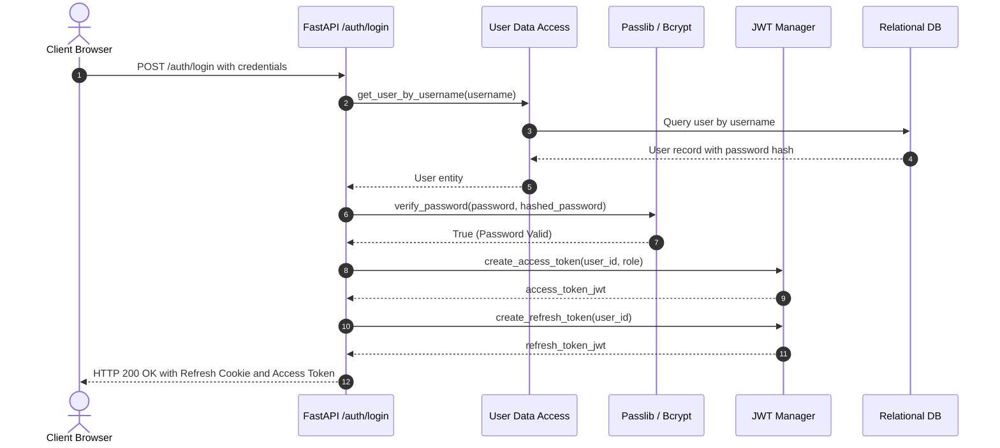
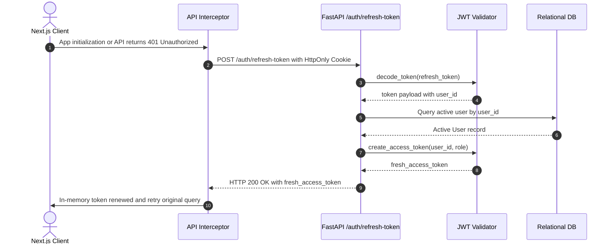
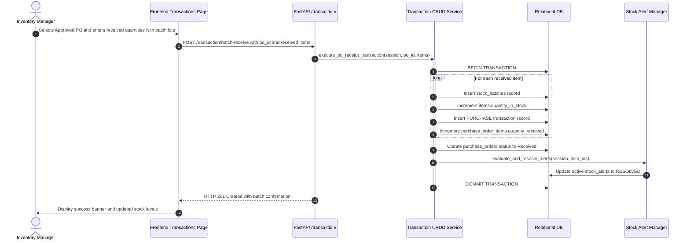
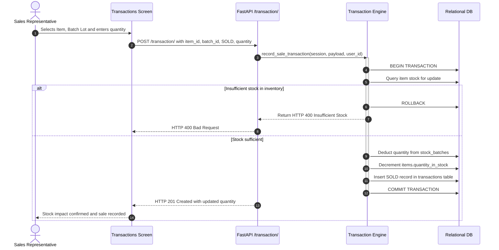
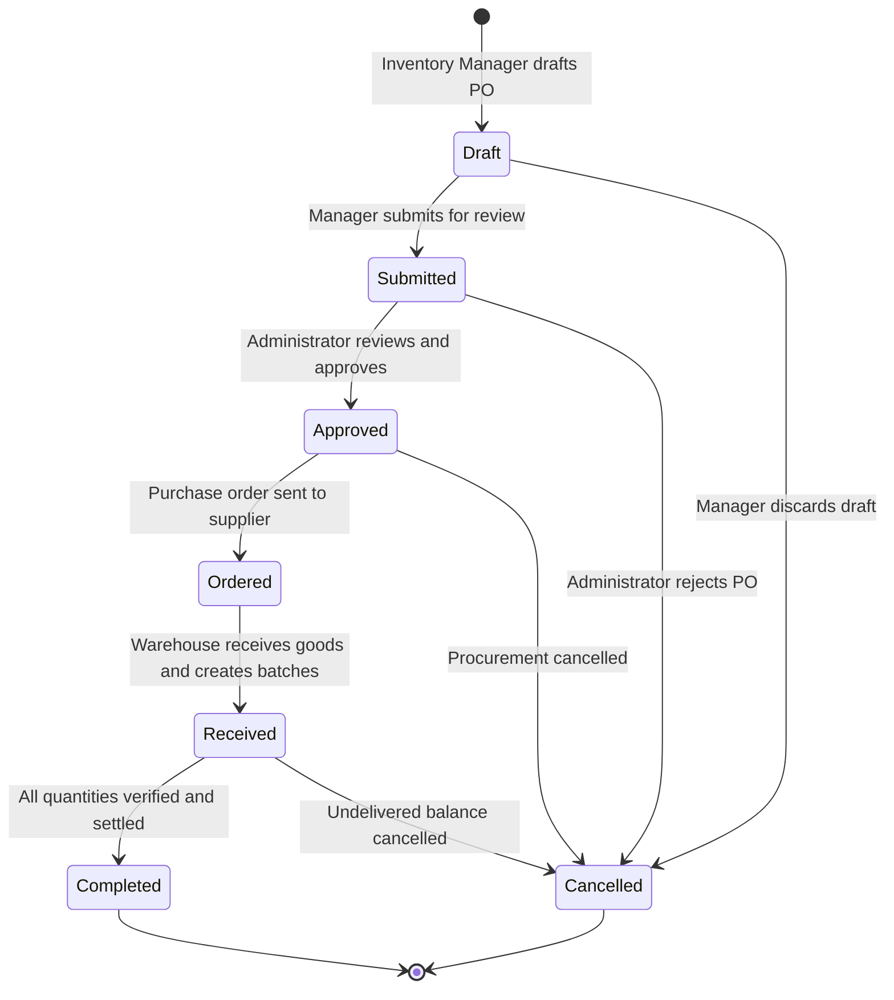
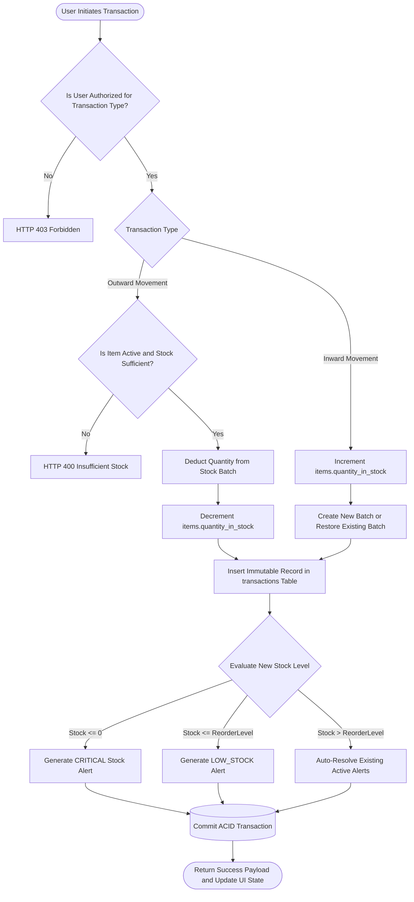
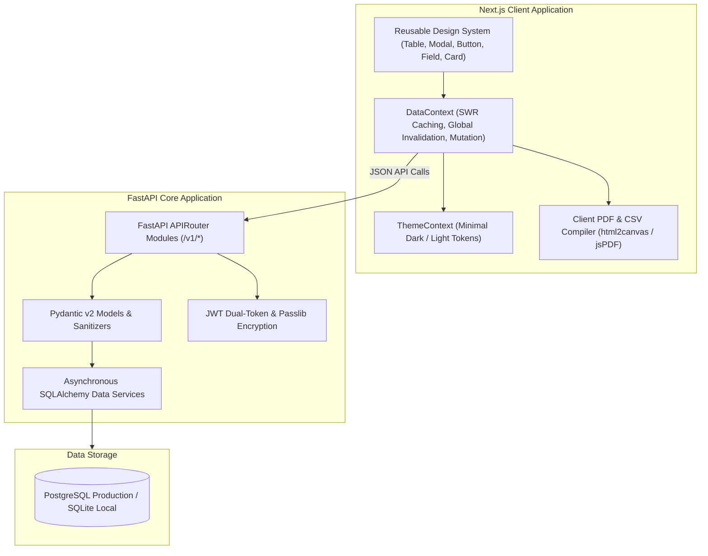

# StockSphere: Comprehensive System Design & Architecture Specification

**Document Version:** 1.0.0  
**Project:** StockSphere Enterprise Inventory & Operations Management Platform  
**Target Audience:** Lead Architects, Senior Engineers, Technical Evaluators, DevOps Teams

---

## 1. Executive Architecture Summary

StockSphere is architected as a modern, decoupled, asynchronous client-server platform designed for high-concurrency inventory operations, real-time procurement governance, and multi-role auditability.

```
┌──────────────────────────────────────────────────────────────────────────────┐
│                               StockSphere Platform                           │
└──────────────────────────────────────────────────────────────────────────────┘
         │                                                            │
         ▼                                                            ▼
┌──────────────────────────────────┐        REST / JSON       ┌──────────────────────────────────┐
│        Frontend Layer            │ ◄──────────────────────► │         Backend Layer            │
│  • Next.js 16 (React 19 App)     │     JWT Auth (Bearer)    │  • FastAPI (Python 3.11+)        │
│  • Custom Design System (CSS)    │     HttpOnly Cookies     │  • Pydantic v2 Validation        │
│  • Theme & DataContext State     │                          │  • SQLAlchemy 2.0 Async ORM      │
│  • Client-side PDF / CSV Engine  │                          │  • Passlib / Bcrypt Encryption   │
└──────────────────────────────────┘                          └──────────────────────────────────┘
                                                                               │
                                                                               ▼
                                                              ┌──────────────────────────────────┐
                                                              │         Database Layer           │
                                                              │  • PostgreSQL (AsyncPG Engine)   │
                                                              │  • SQLite (aiosqlite Dev/Test)   │
                                                              │  • ACID Multi-Table Transactions │
                                                              └──────────────────────────────────┘
```

---

## 2. System Architecture Diagram



---

## 3. Entity-Relationship (ER) Diagram

The StockSphere database comprises 13 interconnected relational entities enforcing foreign key constraints, composite unique indexes, and audit timestamps.



---

## 4. Use Case Diagram

```mermaid
graph LR
    subgraph Actors ["System Actors"]
        Admin["System Administrator"]
        Manager["Inventory Manager"]
        Sales["Sales Representative"]
        Auditor["Compliance Auditor"]
    end

    subgraph Authentication_Module ["Authentication and Profile"]
        UC_Login["Login and Silent Session Refresh"]
        UC_Profile["Manage User Profile"]
        UC_PWRecover["Password Recovery"]
    end

    subgraph User_Module ["User Administration"]
        UC_UserCRUD["Manage Users and Roles"]
        UC_UserBatch["Batch Delete Users"]
    end

    subgraph Master_Data_Module ["Catalog and Sourcing"]
        UC_ItemCRUD["Manage Item Catalog"]
        UC_CategoryCRUD["Manage Categories and Units"]
        UC_SupCRUD["Manage Suppliers Directory"]
        UC_SupLink["Link Many-to-Many Sourcing"]
    end

    subgraph Procurement_Module ["Purchase Orders"]
        UC_POCreate["Create Draft PO"]
        UC_POSubmit["Submit PO for Approval"]
        UC_POApprove["Approve or Cancel PO"]
        UC_POReceive["Receive Goods and Create Batches"]
    end

    subgraph Inventory_Module ["Transactions and Stock"]
        UC_TxSale["Record Customer Sale"]
        UC_TxReturn["Process Customer Return"]
        UC_TxAdjust["Stock Adjustments and Write-Offs"]
        UC_TxAudit["View Transaction Ledgers"]
    end

    subgraph Alerts_Reports_Module ["Monitoring and Business Intelligence"]
        UC_Alerts["View Alerts and Restock Capital"]
        UC_Reports["Generate 6 Enterprise Reports"]
        UC_Export["Export PDF and CSV Ledgers"]
        UC_AuditLogs["Inspect Audit Logs"]
    end

    Admin --> UC_Login
    Admin --> UC_UserCRUD
    Admin --> UC_UserBatch
    Admin --> UC_ItemCRUD
    Admin --> UC_CategoryCRUD
    Admin --> UC_SupCRUD
    Admin --> UC_SupLink
    Admin --> UC_POApprove
    Admin --> UC_POReceive
    Admin --> UC_TxAdjust
    Admin --> UC_TxAudit
    Admin --> UC_Alerts
    Admin --> UC_Reports
    Admin --> UC_Export
    Admin --> UC_AuditLogs

    Manager --> UC_Login
    Manager --> UC_ItemCRUD
    Manager --> UC_CategoryCRUD
    Manager --> UC_SupCRUD
    Manager --> UC_SupLink
    Manager --> UC_POCreate
    Manager --> UC_POSubmit
    Manager --> UC_POReceive
    Manager --> UC_TxAdjust
    Manager --> UC_TxAudit
    Manager --> UC_Alerts
    Manager --> UC_Reports
    Manager --> UC_Export

    Sales --> UC_Login
    Sales --> UC_Profile
    Sales --> UC_TxSale
    Sales --> UC_TxReturn
    Sales --> UC_TxAudit

    Auditor --> UC_Login
    Auditor --> UC_Profile
    Auditor --> UC_TxAudit
    Auditor --> UC_Alerts
    Auditor --> UC_Reports
    Auditor --> UC_Export
    Auditor --> UC_AuditLogs
```



---

## 5. Sequence Diagrams

### 5.1 Login, Credential Verification & Dual-Token Issuance



---

### 5.2 Silent Authentication & Session Restoration



---

### 5.3 Purchase Order Goods Receipt & Batch Generation



---

### 5.4 Customer Sale (`SOLD`) with FIFO Batch Deduction



---

## 6. Activity & Workflow State Machines

### 6.1 Purchase Order Lifecycle State Machine



---

### 6.2 Stock Movement & Integrity Validation Flow



---

## 7. Component & Module Interaction



---

## 8. Database Design Considerations

### 8.1 Foreign Key Referential Integrity

All relational links are strictly enforced with SQL constraints:

- `items.category_id` $\rightarrow$ `categories.category_id` (`ON DELETE RESTRICT`)
- `items.unit_id` $\rightarrow$ `units.unit_id` (`ON DELETE SET NULL`)
- `item_suppliers.item_id` $\rightarrow$ `items.item_id` (`ON DELETE CASCADE`)
- `item_suppliers.supplier_id` $\rightarrow$ `suppliers.supplier_id` (`ON DELETE CASCADE`)
- `purchase_order_items.po_id` $\rightarrow$ `purchase_orders.po_id` (`ON DELETE CASCADE`)
- `transactions.item_id` $\rightarrow$ `items.item_id` (`ON DELETE RESTRICT`)
- `transactions.user_id` $\rightarrow$ `users.user_id` (`ON DELETE RESTRICT`)

### 8.2 Database Indexing Strategy

To guarantee fast lookups and high transaction throughput across 100,000+ rows:

1. **Primary Key Clustered B-Trees:** Standard on all UUID PK columns.
2. **Unique Composite Indexes:**
   - `users(user_name)` & `users(email)`
   - `items(sku)` & `items(item_name)`
   - `suppliers(supplier_name)` & `suppliers(email)`
   - `stock_batches(batch_number)`
3. **Foreign Key Search Indexes:**
   - `transactions(item_id, transaction_date)`
   - `transactions(user_id, transaction_date)`
   - `stock_batches(item_id, current_quantity)`
   - `purchase_orders(supplier_id, status)`
   - `stock_alerts(item_id, status)`
