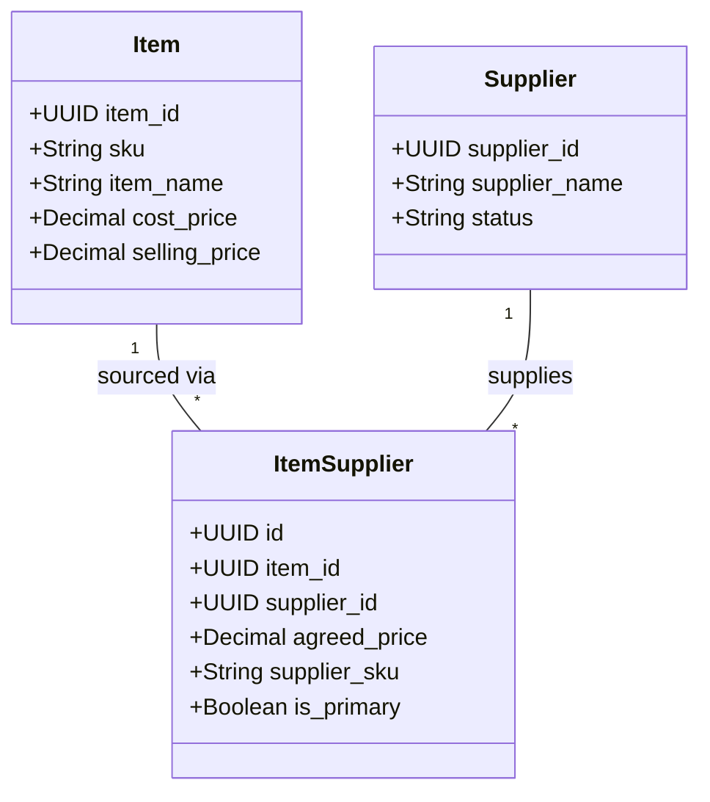

# StockSphere: Business Logic, Rules & Operational Algorithms

**Document Version:** 1.0.0  
**Project:** StockSphere Enterprise Inventory & Operations Management Platform  
**Target Audience:** Software Engineers, QA Automation Teams, Solution Architects, Business Analysts  

---

## 1. Introduction

This document details the exact business rules, computational algorithms, state machines, and mathematical logic governing operations within the **StockSphere** platform. It provides the algorithmic foundation for stock movements, procurement governance, inventory valuation, and compliance auditing.

---

## 2. Stock Health Monitoring & Alert Engine

### 2.1 Health Status Classification Algorithm
Stock levels are continuously evaluated against item-specific thresholds whenever an inventory transaction or goods receipt occurs:

$$\text{Health Status}(Q, R) = \begin{cases} \mathbf{CRITICAL} & \text{if } Q \le 0 \\ \mathbf{LOW\_STOCK} & \text{if } 0 < Q \le R \\ \mathbf{HEALTHY} & \text{if } Q > R \end{cases}$$

Where:
- $Q =$ Current Stock Balance (`items.quantity_in_stock`)
- $R =$ Configured Reorder Alert Level (`items.reorder_level`)

### 2.2 Alert Creation & De-duplication Rule
- When an item enters `CRITICAL` or `LOW_STOCK` status, the alert engine queries `stock_alerts` for an existing record where `item_id = ?` and `status = 'ACTIVE'`.
- If an active alert exists, the existing record is updated with the latest `current_quantity`.
- If no active alert exists, a new alert record is created:
  - `alert_level`: `'CRITICAL'` if $Q \le 0$ else `'LOW_STOCK'`
  - `current_quantity`: $Q$
  - `threshold_quantity`: $R$
  - `status`: `'ACTIVE'`
  - `created_at`: `CURRENT_TIMESTAMP`

### 2.3 Automated Alert Resolution
- When an inbound stock movement (`PURCHASE`, `CUSTOMER_RETURN`, `ADJUSTMENT_INCREASE`) causes $Q > R$, the system automatically executes:
  ```sql
  UPDATE stock_alerts 
  SET status = 'RESOLVED', resolved_at = CURRENT_TIMESTAMP 
  WHERE item_id = :item_id AND status = 'ACTIVE';
  ```
- **Mean Time to Resolve (MTTR):** Evaluated as $\text{MTTR} = \text{AVG}(\text{resolved\_at} - \text{created\_at})$ across all resolved alerts within a reporting period.

### 2.4 Replenishment Capital Projection Formula
For all items in `CRITICAL` or `LOW_STOCK` status:

$$\text{Restock Qty} = \begin{cases} \text{reorder\_quantity} & \text{if } \text{reorder\_quantity} > 0 \\ \max(1, \text{reorder\_level} \times 2 - Q) & \text{otherwise} \end{cases}$$

$$\text{Estimated Restock Capital} = \sum (\text{Restock Qty}_i \times \text{cost\_price}_i)$$

---

## 3. Supplier-Item Sourcing & Many-to-Many Architecture



### 3.1 Sourcing Business Rules
1. **Multi-Supplier Redundancy:** A single item can be linked to multiple suppliers in `item_suppliers`. Each record maintains an independent `agreed_price` and optional `supplier_sku`.
2. **Single Primary Supplier Invariant:** At most one supplier link per item may have `is_primary = True`.
   - Setting a supplier as primary automatically executes an atomic update setting `is_primary = False` on all sibling links for that item.
3. **Automated Procurement Price Pre-fill:** When creating a Purchase Order for a selected supplier, adding an item automatically pre-populates its line item unit price from `item_suppliers.agreed_price` (falling back to `items.cost_price` if unlinked).

---

## 4. Stock Batches & Cost Accounting Rules

### 4.1 Batch Lot Creation
Whenever inventory arrives via Purchase Order receiving or direct purchase:
- A unique `batch_number` is generated (e.g. `LOT-2026-0831-XXXX` or supplier lot number).
- `initial_quantity` is recorded and equals `current_quantity`.
- `purchase_price` captures the exact acquisition cost for that specific lot.
- `expiry_date` is recorded if the item is perishable or time-sensitive.
- `selling_price` is initialized to the item's default selling price with optional per-batch price override.

### 4.2 FIFO / Lot Deduction Rule
- When executing a customer sale (`SOLD`), the operator or system designates the specific batch to deduct from.
- System validates `stock_batches.current_quantity >= sale_quantity`.
- The batch is decremented: `current_quantity = current_quantity - sale_quantity`.
- If `stock_batches.selling_price` is defined and differs from `items.selling_price`, the batch selling price is applied by default with an override flag.

---

## 5. Purchase Order State Machine & Rules

```
┌───────────┐      Submit      ┌─────────────┐      Approve      ┌──────────────┐
│   Draft   │ ───────────────► │  Submitted  │ ────────────────► │   Approved   │
└───────────┘                  └─────────────┘                   └──────────────┘
      │                              │                                  │
      │ Cancel                       │ Cancel                           │ Dispatch
      ▼                              ▼                                  ▼
┌───────────┐                  ┌─────────────┐                   ┌──────────────┐
│ Cancelled │                  │  Cancelled  │                   │   Ordered    │
└───────────┘                  └─────────────┘                   └──────────────┘
                                                                        │
                                                                        │ Goods Arrival
                                                                        ▼
┌───────────┐                  Settled                           ┌──────────────┐
│ Completed │ ◄───────────────────────────────────────────────── │   Received   │
└───────────┘                                                    └──────────────┘
```

### 5.1 Permitted Transitions & Authority Matrix

| Starting State | Target State | Trigger Action | Required Role | Preconditions |
| :--- | :--- | :--- | :--- | :--- |
| *None* | `Draft` | Create PO | `ADMIN`, `INVENTORY_MANAGER` | Active supplier, $\ge 1$ line item. |
| `Draft` | `Submitted` | Submit for Review | `INVENTORY_MANAGER` | Line items valid and $> 0$ total cost. |
| `Draft` | `Cancelled` | Discard PO | `ADMIN`, `INVENTORY_MANAGER` | None. |
| `Submitted` | `Approved` | Approve PO | `ADMIN` | Admin verification of budget/quantities. |
| `Submitted` | `Cancelled` | Reject PO | `ADMIN` | Cancellation reason logged. |
| `Approved` | `Ordered` | Send to Vendor | `ADMIN`, `INVENTORY_MANAGER` | Purchase contract transmitted. |
| `Approved` / `Ordered` | `Received` | Receive Goods | `ADMIN`, `INVENTORY_MANAGER` | Physical receipt & batch lot creation. |
| `Received` | `Completed` | Final Settlement | `ADMIN`, `INVENTORY_MANAGER` | All items received and verified. |

---

## 6. Role-Based Access Control (RBAC) Governance Matrix

| Resource / Module | Endpoint / Action | `ADMIN` | `INVENTORY_MANAGER` | `SALES` | `AUDITOR` |
| :--- | :--- | :---: | :---: | :---: | :---: |
| **Authentication** | `/auth/login`, `/auth/refresh-token` | Full | Full | Full | Full |
| **User Administration** | `/users/*` (Create, Edit, Delete, Roles) | Full | Denied | Denied | Denied |
| **Master Items** | `/items/` (Read Catalog) | Read | Read | Read | Read |
| **Master Items** | `/items/` (Create, Edit, Status, Delete) | Full | Full | Denied | Denied |
| **Units & Categories** | `/units/*`, `/categories/*` | Full | Full | Denied | Denied |
| **Suppliers & Sourcing** | `/suppliers/*`, `/item-suppliers/*` | Full | Full | Denied | Denied |
| **Purchase Orders** | `/purchase-orders/` (Create Draft, Submit) | Full | Full | Denied | Denied |
| **Purchase Orders** | `/purchase-orders/{id}/status` (Approve / Reject) | Full | Denied | Denied | Denied |
| **Transactions** | `/transaction/` (Record Sale `SOLD`) | Full | Full | Full | Denied |
| **Transactions** | `/transaction/` (Record Goods Receipt `PURCHASE`) | Full | Full | Denied | Denied |
| **Transactions** | `/transaction/` (Customer Return `RETURN`) | Full | Full | Full | Denied |
| **Transactions** | `/transaction/` (Adjustments, Damaged, Expired) | Full | Full | Denied | Denied |
| **Stock Alerts** | `/stock-alerts/*` | Full | Full | Denied | Read-Only |
| **Reports Engine** | `/reports/*` (Generate, View, Export PDF/CSV) | Full | Full | Denied | Full |
| **Audit Logs** | `/audit-logs/*` | Full | Denied | Denied | Full |

---

## 7. 7-Type Inventory Movement Mathematics

Every inventory modification must be classified under one of 7 standard movement types:

| Transaction Type | Physical Operation | Stock Impact | Batch Impact | Accounting Impact |
| :--- | :--- | :---: | :---: | :--- |
| **`PURCHASE`** | PO Receiving / Direct Buy | $+ \Delta Q$ | Creates new batch lot | Capital asset addition |
| **`SOLD`** | Retail / Wholesale Sale | $- \Delta Q$ | Deducts from selected batch | Revenue generated |
| **`CUSTOMER_RETURN`**| Defect-free goods returned | $+ \Delta Q$ | Restores original batch | Revenue reversal |
| **`DAMAGED`** | Warehouse breakage / defect | $- \Delta Q$ | Deducts from defective batch | Operational cost write-off |
| **`EXPIRED`** | Past expiration date | $- \Delta Q$ | Deducts from expired batch | Spoilage loss write-off |
| **`ADJUSTMENT_INCREASE`**| Physical surplus reconciliation | $+ \Delta Q$ | Creates audit batch | Stock gain adjustment |
| **`ADJUSTMENT_DECREASE`**| Physical deficit reconciliation | $- \Delta Q$ | Deducts from target batch | Stock shrinkage adjustment |

### 7.1 Mathematical Invariant
At all times and across all operations:

$$\text{items.quantity\_in\_stock} = \sum_{b \in \text{StockBatches}} b.\text{current\_quantity}$$

$$\text{items.quantity\_in\_stock} \ge 0 \quad (\text{Strict Negative Stock Prohibition})$$

---

## 8. 6 Enterprise Business Report Calculations

```
┌─────────────────────────────────────────────────────────────────────────────┐
│                          StockSphere Reporting Engine                       │
├──────────────────────┬──────────────────────┬───────────────────────────────┤
│ 1. Overall Summary   │ 2. Stock Health      │ 3. Category Valuation & Margin│
├──────────────────────┼──────────────────────┼───────────────────────────────┤
│ 4. Transaction Audit │ 5. Velocity (ABC)    │ 6. Supplier Sourcing & Spend  │
└──────────────────────┴──────────────────────┴───────────────────────────────┘
```

1. **Overall Inventory Summary (`OVERALL_SUMMARY`):**
   - $\text{Total Stock Worth (Cost)} = \sum (\text{quantity\_in\_stock}_i \times \text{cost\_price}_i)$
   - $\text{Total Retail Value} = \sum (\text{quantity\_in\_stock}_i \times \text{selling\_price}_i)$
   - $\text{Projected Gross Profit} = \text{Total Retail Value} - \text{Total Stock Worth}$
   - $\text{Sell-Through Rate} = \frac{\text{Outflow Units}}{\text{Inflow Units} + \text{Opening Stock}} \times 100$

2. **Stock Alerts & Replenishment (`LOW_STOCK`):**
   - Out-of-Stock count ($Q \le 0$), Low-Stock count ($0 < Q \le R$), MTTR, and itemized primary supplier sourcing schedule.

3. **Category Valuation & Margins (`CATEGORY_WISE`):**
   - Category inventory share $\% = \frac{\text{Category Stock Units}}{\text{Total Stock Units}} \times 100$
   - Category Gross Margin $\% = \frac{\text{Retail Worth} - \text{Cost Worth}}{\text{Retail Worth}} \times 100$

4. **Transaction Audit Ledger (`TRANSACTION`):**
   - Chronological ledger with total inflow units, total outflow units, net stock change, sales revenue, procurement spend, and `@operator_username` attribution.

5. **Stock Movement & ABC Velocity (`STOCK_MOVEMENT`):**
   - $\text{Opening Stock} = \max(0, \text{Closing Stock} - \text{Inflow} + \text{Outflow})$
   - $\text{Inventory Turnover Rate} = \frac{\text{Outflow Units}}{\text{Average Stock}} \times 100$
   - **ABC Velocity Classification:**
     - **Class A (Fast-Moving):** $\ge 40$ outflow units in period.
     - **Class B (Steady-Moving):** $15 - 39$ outflow units in period.
     - **Class C (Slow-Moving):** $1 - 14$ outflow units in period.
     - **Non-Moving:** $0$ outflow units in period.

6. **Supplier Sourcing & Spend Scorecard (`SUPPLIER`):**
   - Total purchase spend, total purchase orders, completed vs. pending POs, and Fulfillment Rate $\% = \frac{\text{Completed POs}}{\text{Total POs}} \times 100$.

---

## 9. Data Validation & Formatting Rules

### 9.1 Sri Lankan National Identity Card (NIC) Validation
Implemented in [backend/app/schemas/user.py](file:///c:/Musfir_Thahir/Studies/Projects/StockSphere/backend/app/schemas/user.py):
- **Old Format:** 9 digits followed by `'V'` or `'X'` (e.g. `981234567V`).
- **New Format:** 12 numeric digits (e.g. `199812345678`).
- **Regex:** `^(\d{9}[VvXx]|\d{12})$`

### 9.2 Sri Lankan Phone Number Validation
Implemented in [backend/app/schemas/user.py](file:///c:/Musfir_Thahir/Studies/Projects/StockSphere/backend/app/schemas/user.py) and [backend/app/schemas/supplier.py](file:///c:/Musfir_Thahir/Studies/Projects/StockSphere/backend/app/schemas/supplier.py):
- **Format:** Exactly 10 digits starting with `0` (e.g. `0771234567`, `0712345678`, `0112345678`).
- **Sanitization:** Automatically strips spaces and hyphens prior to validation.
- **Regex:** `^0\d{9}$`

### 9.3 Username & Name Conventions
- **Username:** Lowercase alphanumeric characters, periods (`.`), and underscores (`_`) with regex `^[a-z0-9._]+$`.
- **Full Name / Supplier Name:** Letters and spaces with regex `^[a-zA-Z\s]+$`.
- **Report Name:** Any non-empty title string up to 100 characters.
