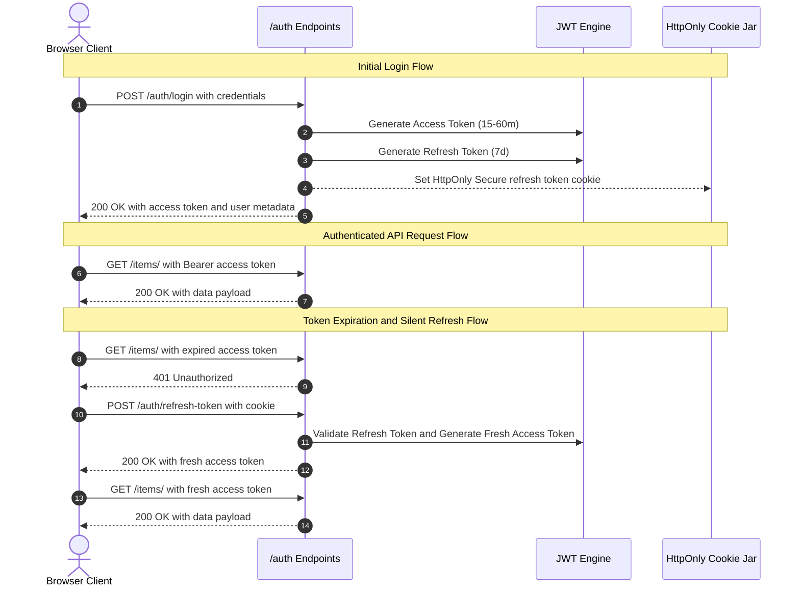
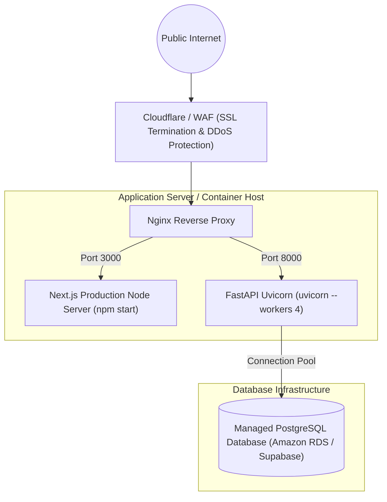

# StockSphere: Comprehensive Technical Implementation Specification

**Document Version:** 1.0.0  
**Project:** StockSphere Enterprise Inventory & Operations Management Platform  
**Target Audience:** Software Engineers, DevOps Engineers, Technical Evaluators, System Administrators

---

## 1. Technical Stack & Implementation Overview

| Tier / Domain            | Technology                   | Version / Configuration | Purpose                                  |
| :----------------------- | :--------------------------- | :---------------------- | :--------------------------------------- |
| **Frontend Framework**   | Next.js (App Router)         | `v16.3.0`               | Server/Client hybrid web application     |
| **Frontend Runtime**     | React & React DOM            | `v19.0.0`               | Component lifecycle & dynamic UI         |
| **Language (Frontend)**  | TypeScript                   | `v5.x`                  | Static typing & interface definitions    |
| **Styling & Theme**      | Vanilla CSS Tokens & Lucide  | Native                  | Dark/Light mode theme system             |
| **PDF & CSV Generation** | `html2canvas` & `jsPDF`      | Latest                  | Client-side ERP ledger export            |
| **Backend Framework**    | FastAPI                      | `v0.115.0+`             | Asynchronous ASGI REST API               |
| **Backend Server**       | Uvicorn                      | `v0.30.0+`              | High-performance ASGI web server         |
| **Language (Backend)**   | Python                       | `v3.11+`                | Business logic & data processing         |
| **ORM & Data Layer**     | SQLAlchemy 2.0 (AsyncIO)     | `v2.0.30+`              | Asynchronous relational data modeling    |
| **Database Engine**      | PostgreSQL / SQLite          | AsyncPG / aiosqlite     | Relational ACID database                 |
| **Data Validation**      | Pydantic v2                  | `v2.8.0+`               | Request/Response schema validation       |
| **Authentication**       | PyJWT & Passlib (Bcrypt)     | Latest                  | Dual-token JWT & password hashing        |
| **Testing Suite**        | Pytest & pytest-asyncio      | `v9.1.1`                | Unit, integration & API test suite       |
| **Package Manager**      | `uv` (Python) & `npm` (Node) | Latest                  | Fast deterministic dependency management |

---

## 2. Frontend Architecture & Component System

### 2.1 Application Directory Structure

```text
frontend/
├── app/
│   ├── dashboard/
│   │   ├── audit_logs/page.tsx        # Audit Trail compliance ledger
│   │   ├── categories/page.tsx        # Category master management
│   │   ├── items/page.tsx             # Items catalog, batch & supplier view
│   │   ├── profile/page.tsx           # User profile & credentials management
│   │   ├── purchase_orders/page.tsx   # Purchase Order procurement lifecycle
│   │   ├── reports/page.tsx           # 6-type chart-free enterprise reports
│   │   ├── stock_alerts/page.tsx      # Stock health & restock estimator
│   │   ├── suppliers/page.tsx         # Supplier directory & contact management
│   │   ├── transactions/page.tsx      # Dedicated full-page 7-tab transaction recording
│   │   ├── users/page.tsx             # User administration & role provisioning
│   │   ├── DataContext.tsx            # Global state cache, SWR mutation & fetchers
│   │   ├── ThemeContext.tsx           # Color tokens & dark/light theme provider
│   │   ├── layout.tsx                 # Dashboard sidebar shell & navigation
│   │   └── page.tsx                   # Executive overview KPI & sales trend dashboard
│   ├── forgot-password/page.tsx       # Password recovery request screen
│   ├── reset-password/page.tsx        # Password reset token entry screen
│   ├── login/page.tsx                 # Authentication screen
│   ├── layout.tsx                     # Root HTML layout & font definitions
│   └── globals.css                    # Global design tokens & CSS variables
├── lib/
│   ├── api.ts                         # Authenticated fetch wrapper with token interceptor
│   ├── roles.ts                       # RBAC permissions helper functions
│   └── types.ts                       # Shared TypeScript interfaces & types
├── package.json
└── tsconfig.json
```

### 2.2 Reusable Design System Tokens

StockSphere uses a lightweight, CSS-variable-based design system defined in `ThemeContext.tsx`:

- `c.surface`: Card and modal background color (`#FFFFFF` in light mode, `#161B22` in dark mode).
- `c.surfaceMuted`: Elevated card header and section background (`#F8FAFC` / `#0D1117`).
- `c.border`: Subtle element border line (`#E2E8F0` / `#30363D`).
- `c.accent`: Corporate indigo accent tone (`#4F46E5` / `#6366F1`).
- `c.text`: High-contrast primary typography (`#0F172A` / `#F0F6FC`).
- `c.textMuted`: Secondary label typography (`#64748B` / `#8B949E`).

---

## 3. Backend Architecture & Service Layers

### 3.1 Backend Directory Structure

```text
backend/
├── app/
│   ├── crud/                          # Asynchronous Database Query Services
│   │   ├── audit_log.py               # Audit log querying and logging
│   │   ├── category.py                # Category CRUD operations
│   │   ├── dashboard.py               # KPI aggregation & 7-day sales trend queries
│   │   ├── item.py                    # Item master & stock balance operations
│   │   ├── item_supplier.py           # Many-to-many sourcing relationship CRUD
│   │   ├── purchase_order.py          # PO state machine & line item services
│   │   ├── report.py                  # 6 Enterprise report aggregations & history
│   │   ├── stock_alert.py             # Stock health alerts & MTTR calculations
│   │   ├── stock_batch.py             # Stock batch lot creation & depletion
│   │   ├── supplier.py                # Supplier directory operations
│   │   ├── transaction.py             # 7-Type transaction execution & FIFO deduction
│   │   ├── unit.py                    # Measurement unit CRUD operations
│   │   └── user.py                    # User authentication & user management
│   ├── routes/
│   │   ├── dependencies.py            # JWT token verification & RoleChecker RBAC
│   │   └── v1/                        # Version 1 API Route Controllers
│   │       ├── auth.py                # Login, Refresh, Logout, Password Recovery
│   │       ├── dashboard.py           # Dashboard KPI endpoint
│   │       ├── item.py                # Item endpoints
│   │       ├── purchase_order.py      # PO lifecycle endpoints
│   │       ├── report.py              # Report generation & PDF/CSV routes
│   │       ├── transaction.py         # Transaction recording endpoints
│   │       └── user.py                # User administration endpoints
│   ├── schemas/                       # Pydantic v2 Request/Response Validation Schemas
│   │   ├── auth.py                    # Token & login schemas
│   │   ├── dashboard.py               # Dashboard response schema
│   │   ├── item.py                    # Item create/update schemas
│   │   ├── purchase_order.py          # PO line item schemas
│   │   ├── report.py                  # 6-type report data payload schemas
│   │   ├── transaction.py             # Transaction request/response schemas
│   │   └── user.py                    # User schemas with NIC & phone validators
│   ├── database.py                    # Async engine & sessionmaker configuration
│   ├── models.py                      # SQLAlchemy 2.0 declarative database entities
│   └── app.py                         # FastAPI application factory & CORS configuration
├── seed_data.py                       # Realistic enterprise database seeder
├── pyproject.toml                     # Python dependencies & build configuration
└── .env                               # Environment variables configuration
```

---

## 4. Requirement Traceability Matrix

| Req ID       | Description                 | Frontend View                | Backend Route                        | Database Entity   | Test Suite                     |
| :----------- | :-------------------------- | :--------------------------- | :----------------------------------- | :---------------- | :----------------------------- |
| `FR-AUTH-01` | User Login & JWT Dual Token | `/login`                     | `POST /auth/login`                   | `users`           | `test_auth_routes.py`          |
| `FR-AUTH-02` | Silent Session Restoration  | `lib/api.ts`                 | `POST /auth/refresh-token`           | `users`           | `test_auth_routes.py`          |
| `FR-AUTH-04` | Password Recovery Request   | `/forgot-password`           | `POST /auth/forgot-password`         | `users`           | `test_auth_routes.py`          |
| `FR-USR-02`  | Create System User          | `/dashboard/users`           | `POST /users/`                       | `users`           | `test_user_routes.py`          |
| `FR-USR-03`  | User Role & Status Update   | `/dashboard/users`           | `PATCH /users/{id}`                  | `users`           | `test_user_routes.py`          |
| `FR-ITM-01`  | Master Item Catalog         | `/dashboard/items`           | `GET /items/`                        | `items`           | `test_group1_models.py`        |
| `FR-ITM-02`  | Create Master Item          | `/dashboard/items`           | `POST /items/`                       | `items`           | `test_group1_models.py`        |
| `FR-SUP-02`  | M:N Supplier-Item Linkage   | `/dashboard/items`           | `POST /item-suppliers/`              | `item_suppliers`  | `test_item_supplier_routes.py` |
| `FR-PO-01`   | Create Purchase Order       | `/dashboard/purchase_orders` | `POST /purchase-orders/`             | `purchase_orders` | `test_po_lifecycle.py`         |
| `FR-PO-03`   | Approve Purchase Order      | `/dashboard/purchase_orders` | `PATCH /purchase-orders/{id}/status` | `purchase_orders` | `test_po_lifecycle.py`         |
| `FR-BTC-01`  | Stock Batch Creation        | `/dashboard/transactions`    | `POST /transaction/batch-receive`    | `stock_batches`   | `test_transaction_routes.py`   |
| `FR-TX-02`   | Record Customer Sale        | `/dashboard/transactions`    | `POST /transaction/`                 | `transactions`    | `test_transaction_routes.py`   |
| `FR-TX-06`   | Stock Variance Adjustment   | `/dashboard/transactions`    | `POST /transaction/`                 | `transactions`    | `test_transaction_routes.py`   |
| `FR-ALT-01`  | Stock Health Evaluation     | `/dashboard/stock_alerts`    | `GET /stock-alerts/`                 | `stock_alerts`    | `test_group1_models.py`        |
| `FR-REP-01`  | 6 Enterprise Reports        | `/dashboard/reports`         | `POST /reports/`                     | `reports`         | `test_dashboard_routes.py`     |
| `FR-AUD-01`  | Audit Trail Logging         | `/dashboard/audit_logs`      | `GET /audit-logs/`                   | `audit_logs`      | `test_dashboard_routes.py`     |

---

## 5. Dual-Token Authentication & Refresh Rotation



---

## 6. Database Indexing & Query Optimizations

The system implements targeted indexing across high-volume transaction and lookup tables:

```sql
-- 1. Unique Master Key Indexes
CREATE UNIQUE INDEX uq_users_username ON users(user_name);
CREATE UNIQUE INDEX uq_users_email ON users(email);
CREATE UNIQUE INDEX uq_items_sku ON items(sku);
CREATE UNIQUE INDEX uq_items_name ON items(item_name);
CREATE UNIQUE INDEX uq_suppliers_name ON suppliers(supplier_name);
CREATE UNIQUE INDEX uq_batches_number ON stock_batches(batch_number);

-- 2. Foreign Key Search & Join Indexes
CREATE INDEX idx_transactions_item_date ON transactions(item_id, transaction_date);
CREATE INDEX idx_transactions_user_date ON transactions(user_id, transaction_date);
CREATE INDEX idx_stock_batches_item_qty ON stock_batches(item_id, current_quantity);
CREATE INDEX idx_purchase_orders_sup_status ON purchase_orders(supplier_id, status);
CREATE INDEX idx_stock_alerts_item_status ON stock_alerts(item_id, status);
CREATE INDEX idx_audit_logs_user_date ON audit_logs(user_id, created_at);
CREATE INDEX idx_reports_type_date ON reports(report_type, generated_at);
```

---

## 7. Error Handling Architecture

StockSphere uses standard HTTP status codes combined with structured JSON payloads:

```json
{
  "detail": "Insufficient stock in selected batch. Available: 4, Requested: 10."
}
```

| HTTP Status Code         | Meaning                            | Example Trigger                                               |
| :----------------------- | :--------------------------------- | :------------------------------------------------------------ |
| **`200 OK`**             | Request Successful                 | Item fetched, profile updated, report generated.              |
| **`201 Created`**        | Entity Created                     | User created, PO created, transaction recorded.               |
| **`400 Bad Request`**    | Validation / Business Rule Failure | Negative quantity, insufficient batch stock, duplicate SKU.   |
| **`401 Unauthorized`**   | Missing or Expired Token           | Missing Authorization header, invalid JWT signature.          |
| **`403 Forbidden`**      | Insufficient Role Permissions      | Sales clerk attempting to approve a Purchase Order.           |
| **`404 Not Found`**      | Resource Not Found                 | Non-existent `item_id`, missing `po_id`.                      |
| **`422 Unprocessable`**  | Pydantic Schema Violation          | Invalid phone number format, invalid Sri Lankan NIC format.   |
| **`500 Internal Error`** | Unhandled Server Exception         | Database connectivity failure (intercepted with clean error). |

---

## 8. Automated Testing Strategy

The backend includes a comprehensive, automated testing suite built on **Pytest**, **pytest-asyncio**, and **httpx**:

```text
backend/app/tests/
├── conftest.py                   # Async test engine, database fixtures, and client setup
├── factories.py                  # Mock factory generators for users, items, and POs
├── test_auth_routes.py           # Login, logout, refresh token, password recovery tests (3 tests)
├── test_dashboard_routes.py      # KPI, 7-day sales trend, and metrics tests (8 tests)
├── test_group1_models.py         # Database model schema validation tests (1 test)
├── test_item_supplier_routes.py  # Many-to-many supplier sourcing tests (2 tests)
├── test_po_lifecycle.py          # PO Draft -> Submitted -> Approved lifecycle tests (3 tests)
├── test_transaction_routes.py    # 7-type transaction execution tests (4 tests)
├── test_unit_routes.py           # Master measurement units tests (2 tests)
└── test_user_routes.py           # User management, role checking & CRUD tests (17 tests)
```

**Execution Command:**

```bash
uv run python -m pytest
```

\*Current Test Results: **40 passed in 1.00s\***.

---

## 9. Production Deployment Architecture



### Production Build & Execution Commands:

1. **Frontend Production Build:**
   ```bash
   npm run build
   npm start
   ```
2. **Backend Production Server:**
   ```bash
   uv run python -m uvicorn app.app:app --host 0.0.0.0 --port 8000 --workers 4 --log-level info
   ```
